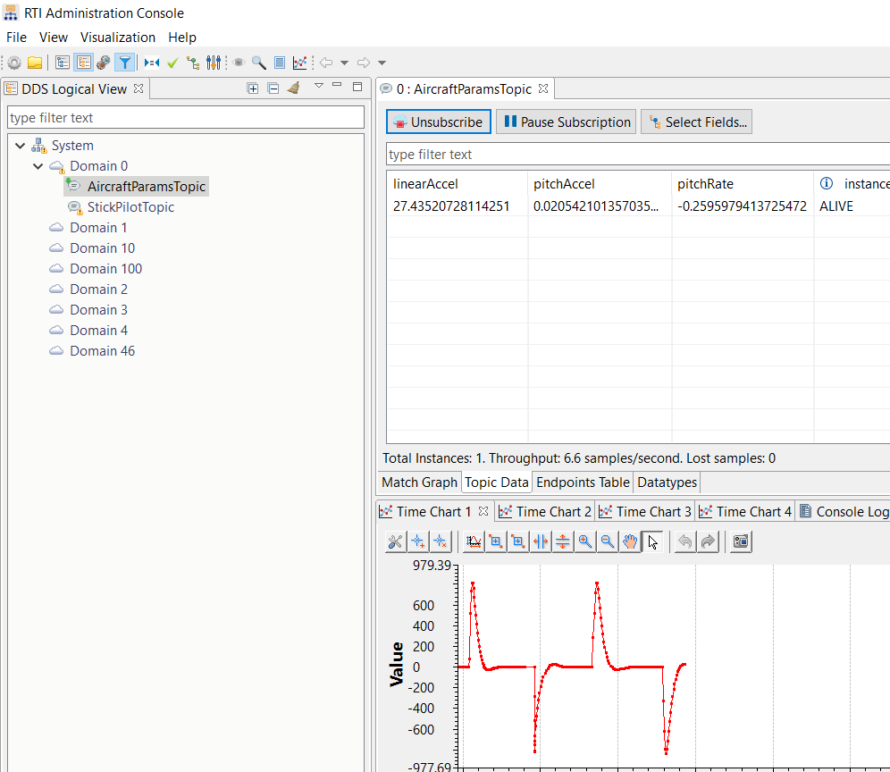
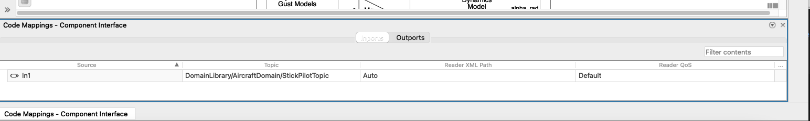

# Example Aircraft Longitudinal Flight Control

## Example description

This example shows how to use the DDS Blockset into an existing Simulink® Model.
The existing model is the example Aircraft Longitudinal Flight Control created
by MathWorks® and built-in in Simulink.

This example reads data of the type `stickPilot` in the topic `StickPilotTopic`
that simulates the input of the aircraft and pilot. Then the model performs its
maths and then writes the linear and pitch acceleration, the pitch rate and the
angle that the aircraft has. All these parameters are included in
`aircraftParams` and are published on the `AircraftParamsTopic` topic.

## Data Model

You can find the DDS data model in the file `dds_type/AircraftSim.xml`. The
`<types>` tag contains the types used by this example.

## Running example

In order to run the example, you need to have RTI Connext DDS installed and
set NDDSHOME environment variable to point to the RTI Connext DDS installation
folder, for example:

```
setenv("NDDSHOME", "C:\Program Files\rti_connext_dds-6.0.1")
```

You may want to install the [RTI Connext for DDS Blockset toolbox](https://es.mathworks.com/matlabcentral/fileexchange/94665-rti-connext-dds-connectivity-framework-for-dds-blockset?s_tid=prof_contriblnk)
to configure properly your environment.

Then, follow these steps:
* Open `slexAircraftExample_dds.slx`
* Configure a `DDS Application` from the `APP` tab
* Choose `RTI Connext 6.0` in the vendor field when configuring the DDS Blockset
* Select the `AircraftSim.sldd` when asking for a dictionary or create a new one
  by selecting the `AircraftSim.xml` file
* Build the example
* Run the generated executable `slexAircraftExample_dds.exe`

You can run [RTI Admin Console](https://www.rti.com/products/tools/admin-console)
to subscribe to the `AircraftParamsTopic` to see your DDS data generated from a
the Simulink model.



Additionally, you can run an [RTI Routing Service](https://www.rti.com/products/is/routing-service)
with the configuration under `stick_pilot_bridge/topic_bridge_w_transf_w_default.xml`
to bridge data from [RTI Shapes Demo](https://www.rti.com/free-trial/shapes-demo)
to `StickPilotTopic` and simulate the stick pilot of the aircraft.

In order to do this run (from the `stick_pilot_bridge` folder):

```
$NDDSHOME/bin/rtiroutingservice -cfgName Square2StickPilot -cfgFile topic_bridge_w_transf_w_default.xml
```

Then you can create a Square in RTI Shapes Demo to control the StickPilot (and
modify the input of the Simulink Model).

**Note**: the `y` value of the `Square` in RTI Shapes Demo is in the range
[0-250]. The example adds a gain of 0.004 to normalize this value between [0-1].

### Modifications to the original example

Once the DDS Dictionary is loaded by Simulink, you need to select which types
your Simulink objects will use:

* Input/Output ports: double click / signal attributes / Data Type. Then you can
  select data types from the DDS Dictionary. Note that these ports should be
  not-virtual.
* Bus Selector: modify this accordingly to the input type.
* Bus Creator: double click / Output data type and select the type that you want
  to build. The bus created should be non-virtual.
* Map the input/output ports with the corresponding DDS Topics. Click on the
  bot/left button called `Code Mappings - Component Interface`.
   * Check that the column 'Topic' points to `DomainLibrary/AircraftDomain/StickPilotTopic`
     in the input and the output to `DomainLibrary/AircraftDomain/AircraftParamsTopic`.
     `DomainLibrary` is a Domain Participant Library and it contains a Domain
     Participant called `AircraftDomain`. You can find these entities defined in
     `AircraftSim.xml` file.



## Files

These are the files that this example contains:

* dds_type
    * `AircraftSim.rtisdproj`: [RTI System Designer](https://www.rti.com/products/tools/system-designer-0)
      project for the `AircraftSim.xml`
    * `AircraftSim.xml`: DDS-XML definition to create the DDS Dictionary in
      Simulink
* src
    * `AircraftSim.sldd`: DDS dictionary for the Simulink DDS Blockset
    * `slexAircraftExample_dds.slx`: Simulink model
* stick_pilot_bridge
    * `topic_bridge_w_transf_w_default.xml`: RTI Routing Service configuration
      to bridge data from RTI Shapes Demo to `StickPilotTopic`.
* doc: this folder contains documentation files, such as images.
